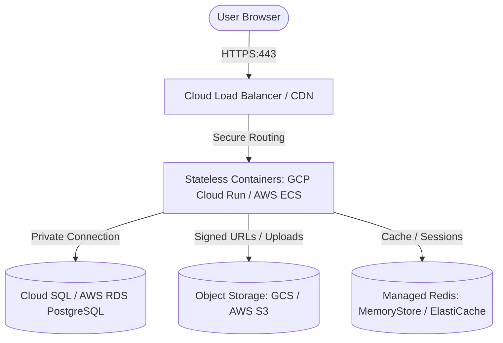

# Cloud Hosting Architecture & Security Blueprint — HCG Knowledge Centre

This document details the production-grade cloud architecture, configuration, data persistence modifications, and comprehensive security hardening measures required to host the HCG Knowledge Centre in a secure and scalable cloud environment.

---

## 1. Cloud Architecture Overview

To achieve high availability, stateless compute scaling, and secure persistence, the application must transition from local file-based database and storage components to distributed cloud services.



### Core Architecture Components
1. **Stateless Compute Layer:**
   - **GCP Cloud Run / AWS ECS Fargate:** Run the Flask application inside lightweight Docker containers. This enables automatic scaling (down to zero instances when idle to minimize costs, or scaling up horizontally under high user loads) and separates compute from data storage.
2. **Managed Relational Database:**
   - **GCP Cloud SQL / AWS RDS (PostgreSQL/MySQL):** Replace the local SQLite file. This enables transaction concurrency, automatic backups, point-in-time recovery (PITR), and prevents write lock deadlocks.
3. **Object Storage Service:**
   - **Google Cloud Storage (GCS) / AWS S3:** Replace the local `uploads/` directory. All PDFs, videos, and PPTs are uploaded directly to secure, private object buckets.
4. **Cache & Session Management (Optional but Recommended):**
   - **GCP Memorystore / AWS ElastiCache (Redis):** Store Flask session states. This ensures users do not lose their login sessions if their traffic is routed to a different container instance (stateless session sharing).

---

## 2. Code Changes for Cloud Readiness

### A. Database Adapter Migration (SQLite $\rightarrow$ Postgres/MySQL)
SQLite is local to the container instance. To support multiple scaling container instances, the `get_db()` connection helper in `app.py` must use a production database engine.

```python
# Refactored Database Adapter in app.py for production
import psycopg2
from psycopg2.extras import RealDictCursor

def get_db():
    """Establish connection to managed PostgreSQL database."""
    connection = psycopg2.connect(
        host=os.getenv("DB_HOST"),
        database=os.getenv("DB_NAME"),
        user=os.getenv("DB_USER"),
        password=os.getenv("DB_PASSWORD"),
        port=os.getenv("DB_PORT", 5432),
        sslmode="require" # Forces SSL connection
    )
    # Configure connection to return dictionary-like records (similar to sqlite3.Row)
    connection.cursor_factory = RealDictCursor
    return connection
```

### B. Object Storage Integration (`storage.py`)
To prevent data loss when stateless containers scale down or restart, rewrite `storage.py` to upload files directly to Cloud Storage using the official Cloud SDK:

```python
# Cloud-native storage.py implementation
from google.cloud import storage
import os
from uuid import uuid4
from werkzeug.utils import secure_filename

ALLOWED_EXTENSIONS = {"pdf", "mp4", "webm", "mov", "avi", "mkv", "ppt", "pptx"}

def save_file_to_gcs(file_obj) -> str:
    """Uploads file to private Google Cloud Storage bucket and returns the GCS URL."""
    original = secure_filename(file_obj.filename or "")
    extension = original.split('.')[-1].lower()
    
    if not original or extension not in ALLOWED_EXTENSIONS:
        raise ValueError("Unsupported file type.")
        
    # Generate unique cloud filename
    filename = f"uploads/{uuid4().hex}.{extension}"
    
    # Initialize GCS client
    bucket_name = os.getenv("GCS_BUCKET_NAME")
    storage_client = storage.Client()
    bucket = storage_client.bucket(bucket_name)
    blob = bucket.blob(filename)
    
    # Upload stream
    blob.upload_from_file(file_obj.stream, content_type=file_obj.content_type)
    
    # Return private URI (accessed via signed URLs for security)
    return blob.public_url
```

---

## 3. Production Security Hardening Measures

### A. Session & Cookie Security
To mitigate Cross-Site Scripting (XSS) and Session Hijacking, Flask session cookies must be hardened using production flags.

> [!IMPORTANT]
> Configure the following flags in Flask's application initialization block (`create_app` in `app.py`):
> ```python
> app.config.update(
>     SESSION_COOKIE_SECURE=True,      # Forces cookies to only be sent over HTTPS connections
>     SESSION_COOKIE_HTTPONLY=True,    # Prevents client-side scripts (JavaScript) from reading the cookie
>     SESSION_COOKIE_SAMESITE='Lax',   # Restricts cookie transmission on cross-site requests to prevent CSRF
>     PERMANENT_SESSION_LIFETIME=1800  # Automatically expires inactive user sessions after 30 minutes
> )
> ```

### B. Secrets Management
Under no circumstances should database passwords, Flask secret keys, or cloud credentials be hardcoded in the codebase.
- **Implementation:** Use a managed secrets manager (e.g., **GCP Secret Manager** or **AWS Secrets Manager**).
- **Execution:** Inject secrets as environment variables into the container environment at runtime:
  - `LMS_SECRET_KEY`: High-entropy random key for signing cookies.
  - `DB_PASSWORD`: Managed credentials for Cloud SQL.
  - `GCS_BUCKET_NAME`: Target bucket identifier.

### C. File Upload Security Controls
Uploading arbitrary files introduces risks of Remote Code Execution (RCE) and Denial of Service (DoS).
1. **Size Restrictions:** Cap the request body size at 100MB (already enforced: `app.config["MAX_CONTENT_LENGTH"] = 100 * 1024 * 1024`).
2. **Filename Sanitization:** Use `secure_filename()` to remove directory traversal sequences (`../../etc/passwd`).
3. **MIME/Type Verification:** Do not rely solely on the file extension. In production, use libraries like `python-magic` to inspect file signatures (magic bytes) to verify that an uploaded `.pdf` is not an executable script.
4. **Execution Prevention:** The object storage bucket must be configured with no public write or execute permissions. Serving static files should be done via signed URLs with temporary access windows.

### D. SQL Injection & XSS Mitigations
- **SQL Injection:** Avoid string interpolation (`f"SELECT * FROM users WHERE name = '{user_input}'"`). Always use parameterized query structures (`connection.execute("SELECT * FROM users WHERE name = ?", (user_input,))`), which treat parameters as literal values rather than executable code.
- **Jinja2 Auto-escaping:** Flask's Jinja2 template engine automatically escapes HTML entities (turning `<script>` into `&lt;script&gt;`). Ensure the `|safe` filter is only used on sanitised data (such as internally-generated markdown rendering) and never on raw user inputs.

---

## 4. Infrastructure & Network Security

### A. Network Isolation (VPC & Private IP)
- **Private Database Endpoint:** Cloud SQL / RDS instances must not have public IP addresses. Place the database inside a private subnet of the Virtual Private Cloud (VPC).
- **Serverless VPC Access:** Use a serverless VPC connector to route container traffic from Cloud Run/ECS into the private VPC subnet to query the database.
- **Encryption in Transit:** Enable TLS/SSL certificates on the PostgreSQL database connections to prevent packet sniffing inside the VPC.

### B. Public Access Gateway & DDoS Protection
- **HTTPS Enforcement:** Terminate TLS/SSL on the external Cloud Load Balancer. Configure HTTP-to-HTTPS redirection.
- **Cloud Armor / AWS WAF:** Deploy a Web Application Firewall in front of the Load Balancer to protect against SQL injection attempts, Cross-Site Scripting payloads, brute force logins, and DDoS attacks.
- **Access Logs and Monitoring:** Forward access logs to centralized logging utilities (like GCP Cloud Logging / CloudWatch) to detect anomalies.

---

## 5. Deployment & CI/CD Pipeline

To ensure secure, repeatable releases:
1. **Containerization (Dockerfile):** Package the app inside a minimal Alpine or Debian-slim base image, run under a non-root user, and expose port 8080:
   ```dockerfile
   FROM python:3.11-slim
   WORKDIR /app
   COPY requirements.txt .
   RUN pip install --no-cache-dir -r requirements.txt
   COPY . .
   EXPOSE 8080
   USER 1000
   CMD ["gunicorn", "-b", "0.0.0.0:8080", "app:create_app()"]
   ```
2. **Automated Testing:** Trigger unit tests and lint checks on every commit inside a secure container pipeline before deployment.
3. **Static Application Security Testing (SAST):** Run vulnerability scans (e.g., using `bandit` for Python) during build phases to inspect dependencies and code patterns for security lapses.
