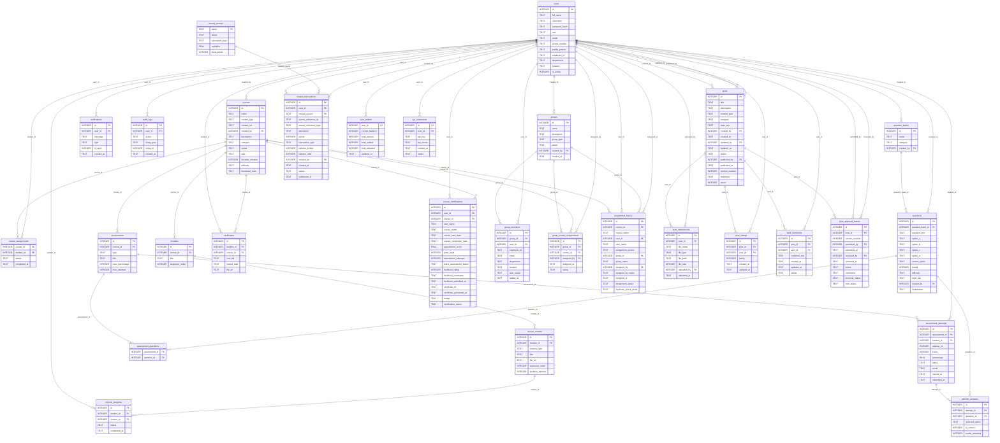

# HCG Knowledge Centre Database - Entity Relationship Diagram

This document contains the Entity Relationship (ER) diagrams for all tables in the `users.db` database.

```mermaid
erDiagram
    users {
        INTEGER id PK
        TEXT full_name
        TEXT username
        TEXT password_hash
        TEXT role
        TEXT email
        TEXT phone_number
        TEXT profile_picture
        TEXT employee_id
        TEXT department
        TEXT location
        INTEGER is_active
    }

    courses {
        INTEGER id PK
        TEXT name
        TEXT content_type
        TEXT content_url
        INTEGER created_by FK
        TEXT description
        TEXT category
        TEXT status
        TEXT tags
        INTEGER duration_minutes
        TEXT difficulty
        TEXT thumbnail_color
    }

    course_assignments {
        INTEGER course_id FK
        INTEGER student_id FK
        TEXT status
        TEXT completed_at
    }

    modules {
        INTEGER id PK
        INTEGER course_id FK
        TEXT title
        INTEGER sequence_order
    }

    course_content {
        INTEGER id PK
        INTEGER module_id FK
        TEXT content_type
        TEXT title
        TEXT file_url
        INTEGER sequence_order
        INTEGER duration_minutes
    }

    content_progress {
        INTEGER id PK
        INTEGER student_id FK
        INTEGER content_id FK
        TEXT status
        TEXT completed_at
    }

    question_banks {
        INTEGER id PK
        TEXT name
        TEXT category
        INTEGER created_by FK
    }

    questions {
        INTEGER id PK
        INTEGER question_bank_id FK
        TEXT question_text
        TEXT option_a
        TEXT option_b
        TEXT option_c
        TEXT option_d
        TEXT correct_option
        INTEGER marks
        TEXT difficulty
        TEXT topic_tag
        INTEGER created_by FK
        TEXT explanation
    }

    assessments {
        INTEGER id PK
        INTEGER course_id FK
        TEXT type
        TEXT title
        INTEGER pass_percentage
        INTEGER max_attempts
    }

    assessment_questions {
        INTEGER assessment_id FK
        INTEGER question_id FK
    }

    assessment_attempts {
        INTEGER id PK
        INTEGER assessment_id FK
        INTEGER student_id FK
        INTEGER attempt_no
        INTEGER score
        REAL percentage
        TEXT status
        TEXT result
        TEXT started_at
        TEXT submitted_at
    }

    attempt_answers {
        INTEGER id PK
        INTEGER attempt_id FK
        INTEGER question_id FK
        TEXT selected_option
        INTEGER is_correct
        INTEGER marks_awarded
    }

    certificates {
        INTEGER id PK
        INTEGER student_id FK
        INTEGER course_id FK
        TEXT cert_uid
        TEXT issued_date
        TEXT file_url
    }

    notifications {
        INTEGER id PK
        INTEGER user_id FK
        TEXT message
        TEXT type
        INTEGER is_read
        TEXT created_at
    }

    audit_logs {
        INTEGER id PK
        INTEGER user_id FK
        TEXT action
        TEXT entity_type
        INTEGER entity_id
        TEXT created_at
    }

    course_certifications {
        INTEGER id PK
        INTEGER user_id FK
        INTEGER course_id FK
        TEXT user_name
        TEXT course_name
        TEXT course_start_date
        TEXT course_completion_date
        REAL assessment_score
        INTEGER pass_mark
        INTEGER assessment_attempts
        TEXT latest_assessment_status
        INTEGER feedback_rating
        TEXT feedback_comments
        TEXT feedback_submitted_at
        TEXT certificate_id
        TEXT certificate_generated_at
        TEXT badge
        TEXT certification_status
    }

    groups {
        INTEGER id PK
        TEXT name
        TEXT description
        TEXT group_type
        TEXT status
        INTEGER created_by FK
        TEXT created_at
    }

    group_members {
        INTEGER id PK
        INTEGER group_id FK
        INTEGER user_id FK
        TEXT employee_id
        TEXT email
        TEXT department
        TEXT location
        TEXT user_status
        TEXT added_at
    }

    group_course_assignments {
        INTEGER id PK
        INTEGER group_id FK
        INTEGER course_id FK
        INTEGER assigned_by FK
        TEXT assigned_at
        TEXT status
    }

    assignment_history {
        INTEGER id PK
        INTEGER course_id FK
        TEXT course_name
        INTEGER user_id FK
        TEXT user_name
        TEXT assignment_source
        INTEGER group_id FK
        TEXT group_name
        INTEGER assigned_by FK
        TEXT assigned_by_name
        TEXT assigned_at
        TEXT assignment_status
        TEXT duplicate_check_result
    }

    posts {
        INTEGER id PK
        TEXT title
        TEXT description
        TEXT content_type
        TEXT category
        TEXT topic_tag
        INTEGER created_by FK
        TEXT created_at
        INTEGER updated_by FK
        TEXT updated_at
        TEXT status
        INTEGER published_by FK
        TEXT published_at
        INTEGER version_number
        TEXT thumbnail
        INTEGER views
    }

    post_attachments {
        INTEGER id PK
        INTEGER post_id FK
        TEXT file_name
        TEXT file_type
        TEXT file_path
        INTEGER file_size
        INTEGER uploaded_by FK
        TEXT uploaded_at
    }

    post_ratings {
        INTEGER id PK
        INTEGER post_id FK
        INTEGER user_id FK
        INTEGER rating
        TEXT created_at
        TEXT updated_at
    }

    post_comments {
        INTEGER id PK
        INTEGER post_id FK
        INTEGER user_id FK
        TEXT comment_text
        TEXT created_at
        TEXT updated_at
        TEXT status
    }

    post_approval_history {
        INTEGER id PK
        INTEGER post_id FK
        INTEGER version_number
        INTEGER submitted_by FK
        TEXT submitted_at
        INTEGER reviewed_by FK
        TEXT reviewed_at
        TEXT action
        TEXT comments
        TEXT previous_status
        TEXT new_status
    }

    reward_sources {
        TEXT name PK
        TEXT status
        TEXT calculation_type
        REAL multiplier
        INTEGER fixed_points
    }

    reward_transactions {
        INTEGER id PK
        INTEGER user_id FK
        TEXT reward_source FK
        TEXT source_reference_id
        TEXT source_reference_type
        TEXT description
        INTEGER points
        TEXT transaction_type
        INTEGER balance_before
        INTEGER balance_after
        INTEGER created_by FK
        TEXT created_at
        TEXT status
        TEXT settlement_id
    }

    user_wallets {
        INTEGER user_id FK
        INTEGER current_balance
        INTEGER total_earned
        INTEGER total_settled
        INTEGER total_adjusted
        TEXT updated_at
    }

    api_credentials {
        INTEGER id PK
        INTEGER user_id FK
        TEXT api_key
        TEXT api_secret
        TEXT created_at
        TEXT status
    }

    users ||--o{ courses : "created_by"
    courses ||--o{ course_assignments : "course_id"
    users ||--o{ course_assignments : "student_id"
    courses ||--o{ modules : "course_id"
    modules ||--o{ course_content : "module_id"
    users ||--o{ content_progress : "student_id"
    course_content ||--o{ content_progress : "content_id"
    users ||--o{ question_banks : "created_by"
    question_banks ||--o{ questions : "question_bank_id"
    users ||--o{ questions : "created_by"
    courses ||--o{ assessments : "course_id"
    assessments ||--o{ assessment_questions : "assessment_id"
    questions ||--o{ assessment_questions : "question_id"
    assessments ||--o{ assessment_attempts : "assessment_id"
    users ||--o{ assessment_attempts : "student_id"
    assessment_attempts ||--o{ attempt_answers : "attempt_id"
    questions ||--o{ attempt_answers : "question_id"
    users ||--o{ certificates : "student_id"
    courses ||--o{ certificates : "course_id"
    users ||--o{ notifications : "user_id"
    users ||--o{ audit_logs : "user_id"
    users ||--o{ course_certifications : "user_id"
    courses ||--o{ course_certifications : "course_id"
    users ||--o{ groups : "created_by"
    groups ||--o{ group_members : "group_id"
    users ||--o{ group_members : "user_id"
    groups ||--o{ group_course_assignments : "group_id"
    courses ||--o{ group_course_assignments : "course_id"
    users ||--o{ group_course_assignments : "assigned_by"
    courses ||--o{ assignment_history : "course_id"
    users ||--o{ assignment_history : "user_id"
    groups ||--o{ assignment_history : "group_id"
    users ||--o{ assignment_history : "assigned_by"
    users ||--o{ posts : "created_by"
    users ||--o{ posts : "updated_by"
    users ||--o{ posts : "published_by"
    posts ||--o{ post_attachments : "post_id"
    users ||--o{ post_attachments : "uploaded_by"
    posts ||--o{ post_ratings : "post_id"
    users ||--o{ post_ratings : "user_id"
    posts ||--o{ post_comments : "post_id"
    users ||--o{ post_comments : "user_id"
    posts ||--o{ post_approval_history : "post_id"
    users ||--o{ post_approval_history : "submitted_by"
    users ||--o{ post_approval_history : "reviewed_by"
    users ||--o{ reward_transactions : "user_id"
    reward_sources ||--o{ reward_transactions : "reward_source"
    users ||--o{ reward_transactions : "created_by"
    users ||--o{ user_wallets : "user_id"
    users ||--o{ api_credentials : "user_id"
```
